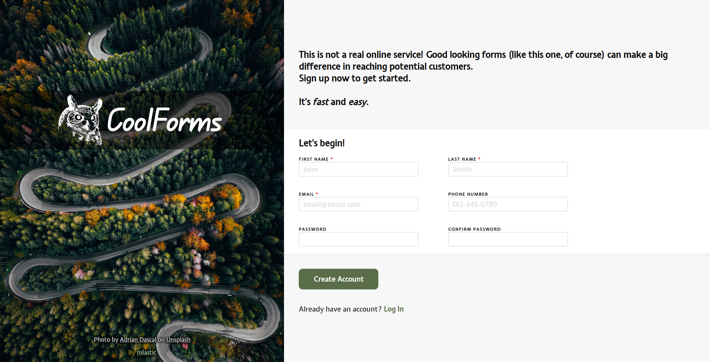

# Sign Up Form

## [Live Preview](https://rolastic.github.io/Sign-Up-Form/)

The form displays invalid input fields when:
- You select a required input field and then click outside of it without entering any information
- You enter an invalid e-mail
- You enter an invalid password format
- Passwords don't match
- You click the submit button and one or more input fields are empty

